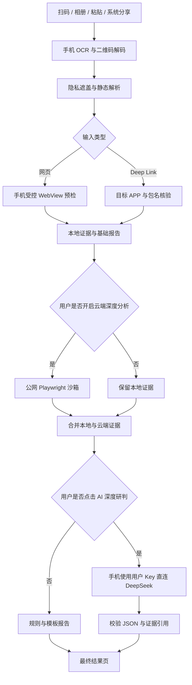
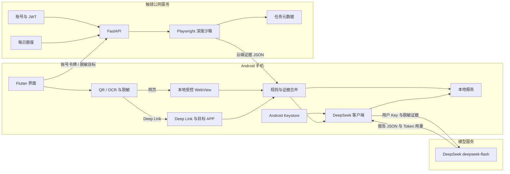

# 触镜 TapLens

> 点开之前，看清承诺与真实行为。

触镜 TapLens 是一款面向二维码、网页链接与 Deep Link 的 Android 安全分析 APP。它会在用户执行操作前，对比宣传内容“承诺了什么”和目标页面或应用“实际准备做什么”，并用可追溯证据解释风险。

本项目拟参加 **华北五省大学生计算机应用大赛·方向二（智能网联与智能终端）**。

> [!NOTE]
> 当前仓库处于开发准备阶段，本文描述的是已经冻结的首版目标和技术方案。功能完成情况将随代码提交持续更新。

## 为什么做触镜

普通扫码工具通常只能展示链接、查询黑名单或提示“可能有风险”。用户仍然很难判断：

- 海报宣传的服务与二维码实际打开的内容是否一致；
- 短链接最终跳转到了谁的域名；
- 页面为什么索取密码、手机号、身份证号等敏感信息；
- Deep Link 准备唤起哪个 APP、携带哪些参数；
- 检测失败时，结果究竟是安全还是证据不足。

触镜关注的是 **承诺—行为差分**：从海报、截图和二维码周边文字提取用户看到的承诺，再从链接、页面、表单、跳转链、目标包名和外部唤起中提取实际行为，最后比较两者是否一致。

## 核心能力

### 1. 四种移动端入口

- 相机扫描二维码；
- 从相册导入海报或截图；
- 粘贴 URL、Deep Link 或文本；
- 从微信、浏览器、相册等应用“分享给触镜”，或在 Android“打开方式”中选择触镜。

### 2. 手机本地受控预检

- QR 解码和 OCR 文字提取；
- 手机号、学号、身份证号、邮箱和 Token 等敏感信息遮盖；
- URL、自定义 Scheme 和 `intent://` 解析；
- 使用 Android `PackageManager` 查询可响应链接的应用与包名；
- 在独立进程 WebView 中观察跳转、表单、下载和外部协议；
- 阻止权限申请、文件访问、表单提交、下载和外部 APP 自动唤起；
- 即使触镜服务器或 AI 不可用，也能生成本地基础报告。

### 3. 云端深度隔离分析

登录用户可主动消耗每日限量额度，通过公网 FastAPI 服务启动一次性 Playwright 浏览器环境，补充：

- 完整重定向链；
- 页面 DOM 与表单字段；
- 网络请求域名；
- 页面截图与异常状态；
- 更稳定、可复现的云端证据。

### 4. AI 承诺—行为差分

AI 根据经过脱敏和编号的证据，从以下维度比较宣传与真实行为：

- 主体是否一致；
- 目的是否一致；
- 数据需求是否超出承诺；
- 目标网站或 APP 是否一致；
- 是否存在未说明的下载、跳转或外部唤起。

AI 输出必须引用真实证据编号。规则判定出的硬风险不能被 AI 降级；信息不足时必须显示“证据不足”，不能用“未发现”代替“安全”。

## 使用流程



## 系统架构



这是一款可以独立安装和操作的手机 APP。开发电脑只用于编写代码；正式使用时，用户不需要打开个人电脑，也不需要与服务器处于同一局域网。

## 隐私与 API Key

触镜采用 BYOK（Bring Your Own Key）方式使用模型服务：

1. 用户在手机中填写自己的 DeepSeek API Key；
2. APP 先发送最小测试请求验证 Key；
3. Key 由 Android Keystore 保护，只保存在当前手机；
4. 用户主动点击“AI 深度研判”后，手机直接请求 DeepSeek；
5. 触镜服务器不接收、不保存、也不转发用户的模型 Key；
6. 每次分析最多发起一次模型请求，并显示接口返回的 Token 用量。

完整检测报告只保存在手机。服务器只保存账号、额度、任务状态和必要的脱敏元数据，不保存完整报告。

## 风险结果

| 状态 | 含义 |
|---|---|
| 低风险 | 在当前证据范围内，承诺与行为基本一致 |
| 中风险 | 存在需要用户确认的异常或信息差异 |
| 高风险 | 发现明确的身份、目标、敏感数据或危险动作冲突 |
| 证据不足 | 页面无法访问、解析失败或缺少足够证据，不能判断安全 |

## 典型演示案例

所有演示目标均由团队自建，不连接真实钓鱼站、支付系统或恶意程序。

### 助学金变贷款

海报宣称“校园助学金申请”，二维码经短链后进入贷款页面，并要求提交身份证号和手机号。触镜展示跳转、表单与宣传目的之间的差异。

### 官方 APP 变错误包名

页面宣称打开官方校园 APP，实际 `intent://` 指向测试仿冒包名，同时携带学号并设置第三方登录页作为 fallback。触镜在真正唤起前显示目标身份冲突。

### 正常校园讲座报名

海报说明网络安全讲座报名需要姓名和学号，目标页面、主体和字段均与宣传一致。触镜给出低风险结果并提醒用户继续核对域名。

## 与同类产品的区别

| 对标能力 | 常见做法 | 触镜的设计 |
|---|---|---|
| 二维码安全 | 展示载荷、信誉或黑名单结果 | 同时理解二维码周边宣传语义 |
| URL 检查 | 短链展开、域名与参数检查 | 比较页面目的、表单和宣传承诺 |
| 安全浏览 | 在隔离环境访问网页 | 本地预检与云端深度沙箱结合 |
| Deep Link | 解析 Scheme 或交给系统打开 | 在执行前核验包名、参数、fallback 和候选 APP |
| AI 解释 | 根据页面内容生成风险说明 | 结论绑定证据编号，硬规则具有更高优先级 |
| 失败状态 | 未发现问题或无法检测 | 单独显示“证据不足” |

## 技术栈

| 层级 | 技术 | 用途 |
|---|---|---|
| 移动端 | Flutter、Dart | 登录、输入、进度、报告、历史和设置 |
| Android 原生 | Kotlin、WebView、Intent、PackageManager | 本地预检、Deep Link 与目标 APP 核验 |
| 端侧识别 | ML Kit、二维码组件 | OCR 与二维码解码 |
| 安全存储 | Android Keystore | 模型 Key 与登录令牌保护 |
| 本地数据 | SQLite 或 Hive | 完整报告历史 |
| 后端 | Python、FastAPI、Pydantic | 账号、JWT、额度、任务和元数据 |
| 云端沙箱 | Playwright、Chromium | 网页动态行为与证据采集 |
| AI | DeepSeek `deepseek-flash` | 单次、非思考模式的语义差分 |
| 部署 | Docker Compose、Nginx、HTTPS | 公网运行和自动重启 |

## 计划中的仓库结构

```text
TapLens/
├── mobile/
│   ├── lib/
│   │   ├── auth/             # 登录与 JWT
│   │   ├── capture/          # 扫码、相册、粘贴与分享
│   │   ├── privacy/          # 端侧脱敏
│   │   ├── evidence/         # 证据合并
│   │   ├── ai/               # DeepSeek 直连与结果校验
│   │   ├── history/          # 本地历史
│   │   └── report_ui/        # 报告界面
│   └── android/app/src/main/kotlin/
│       ├── PreflightActivity.kt
│       ├── DeepLinkAnalyzer.kt
│       └── NativeBridge.kt
├── backend/
│   ├── auth/                 # 注册、登录、密码哈希与 JWT
│   ├── api/                  # 额度、任务与健康检查
│   ├── sandbox/              # Playwright 与安全限制
│   ├── evidence/             # 云端证据标准化
│   ├── fixtures/             # 演示目标页
│   └── storage/              # 用户与任务元数据
├── shared/
│   ├── contracts/            # JSON Schema 与样例
│   ├── fixtures/             # 固定测试数据
│   └── error-codes.md
└── submission/               # 参赛文档、截图、视频与测试报告
```

## 计划中的公网 API

| 接口 | 方法 | 用途 |
|---|---|---|
| `/api/v1/auth/register` | `POST` | 用户名和密码注册 |
| `/api/v1/auth/login` | `POST` | 登录并获取 JWT |
| `/api/v1/quota` | `GET` | 查询当日剩余深度分析次数 |
| `/api/v1/deep-scans` | `POST` | 创建 Playwright 深度分析任务 |
| `/api/v1/deep-scans/{id}` | `GET` | 查询任务状态和云端证据 |
| `/api/v1/deep-scans/{id}` | `DELETE` | 删除任务和临时截图 |
| `/api/v1/task-metadata` | `POST` | 保存不含 URL 和报告的任务元数据 |
| `/api/v1/health` | `GET` | 服务健康检查 |

后端不提供模型调用接口，也不接收 DeepSeek API Key。

## 四人分工

- **A｜Flutter 产品与整合**：完成用户能看到和操作的整个 APP，并把本地安全、云端分析和 AI 模块串成完整流程。
- **B｜账号、云端沙箱与部署**：完成登录与额度系统、Playwright 深度分析服务、演示网页和公网部署。
- **C｜Android 本地安全能力**：完成 URL/Deep Link 解析、目标 APP 核验、受控 WebView 预检与本地硬风险规则。
- **D｜AI、验证、测试与材料**：完成手机端 DeepSeek 调用、证据约束与结果校验、测试集、测试报告和参赛材料。

## 10 天开发计划

| 天数 | 目标 |
|---|---|
| Day 1 | 建立 Flutter、FastAPI 和 Kotlin 骨架，冻结四份 JSON 契约 |
| Day 2 | 完成账号最小闭环、静态链接解析和 AI 最小调用 |
| Day 3 | 完成三种主要输入、WebView 原型、云沙箱原型和 Key 设置页 |
| Day 4 | 由真实手机输入产生可用的本地证据 JSON |
| Day 5 | 完成本地基础报告、Keystore 与首个 AI 差分案例 |
| Day 6 | 串通本地、云端、AI 和最终报告，冻结功能范围 |
| Day 7 | 补齐系统分享与打开方式，跑通三个正式演示案例 |
| Day 8 | 集中进行功能、安全、隐私和异常测试 |
| Day 9 | 生成候选 APK，完成公网部署和故障演练 |
| Day 10 | 冻结版本，整理材料并完成全流程彩排 |

## 首版验收目标

| 指标 | 目标 |
|---|---:|
| QR 与支持范围内 Deep Link 解析成功率 | ≥ 95% |
| 关键动作识别率 | ≥ 90% |
| AI 结论证据绑定率 | 100% |
| 本地静态解析 | ≤ 2 秒 |
| 本地受控预检 | ≤ 8 秒 |
| 云端深度分析平均时间 | ≤ 15 秒，网络异常除外 |
| 每次分析 AI 调用次数 | ≤ 1 次 |
| 敏感字段脱敏测试 | 100% 通过 |
| 云端或 AI 不可用时基础报告可用 | 100% |

以上数值是开发目标，最终参赛材料只填写实际测试结果。

## 首版范围边界

十天首版不包含支付与订阅、邮箱找回、多设备同步、端侧大模型、iOS 版本、通用 APK 分析，也不会自动点击、填写或提交表单，不会自动发送短信、拨打电话、安装应用或发起支付。

对于无法验证的第三方私有协议，触镜会显示“证据不足”，不会让 AI 猜测其真实含义。

## 安全测试重点

- 阻止 `file://`、`content://` 和私网地址进入不可信分析流程；
- 云端防护 localhost、云元数据地址、DNS 重绑定和 SSRF；
- 网页权限、下载、表单提交与外部唤起只记录，不执行；
- DeepSeek Key 不进入日志、后端、截图、崩溃报告或 Git；
- 网页中的提示注入内容不能改变 AI 的证据约束；
- AI 引用不存在的证据时，拒绝该结论并回退到规则报告。

## 项目状态

- [x] 完成需求分析与方案冻结
- [x] 确定双层分析架构与隐私边界
- [x] 确定四人分工与十天计划
- [x] 建立移动端 Flutter 工程骨架并展示固定报告
- [ ] 建立移动端、后端与共享契约代码
- [ ] 跑通本地预检最小闭环
- [ ] 跑通云端深度分析最小闭环
- [ ] 跑通 BYOK AI 差分最小闭环
- [ ] 完成三个演示案例与 30 例测试集
- [ ] 发布候选 APK 与公网服务

## 说明

触镜提供的是执行前风险分析与证据解释，不对任意链接或应用作绝对安全保证。项目不会使用“全球首创”“检测所有恶意二维码”等无法验证的表述。
